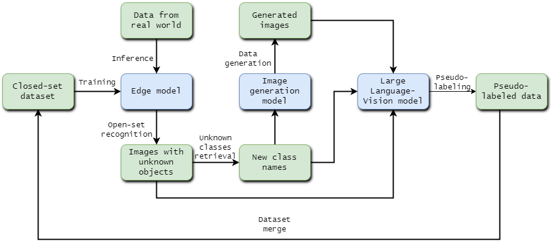

# Open Vocabulary Object Detection with Multimodal and Generative Models

This repository contains the code for the master thesis "[Open Vocabulary Object Detection with Multimodal and Generative Models](https://dspace.cvut.cz/handle/10467/114813?locale-attribute=en)".

## Abstract

Our study explores open-set classification strategies using various architectures like Transformers and CNNs. We introduce Matrix Entropy for multi-view open-set classification, demonstrating its superior performance and simplicity. Our research underscores the benefits of aggregating multiple views of the same object for classification accuracy. We bridge the knowledge gap for unknown classes through pseudo-annotation with large vision-language models and data generation using Stable Diffusion models, leveraging the DataDreamer library. By combining pseudo-annotated real data and synthetic data, we achieve optimal performance. Additionally, we propose a pipeline that enables a small model to continuously learn under the supervision of larger foundation models. Our findings underscore the effectiveness of these approaches in handling unknown classes and enhancing classification and detection performance.



## Installation

```bash
git clone https://github.com/sokovninn/open-world-object-detection.git
cd open-world-object-detection
pip install -r requirements.txt
```

## Usage

Constructing datasets (removing unknown classes):

```bash
python remove_classes.py
python remove_classes_voc.py
```

Training a model:

```bash
python train_yolo.py
```
or 
```bash
yolo train model=... data=... epochs=...
```

Evaluating the open-set classification performance:

```bash
python eval_yolo.py
```

Evaluating the open-set detection performance:

```bash
python eval_yolo_det.py
```

Label retrieval for unknown classes:

```bash
python label_retrieval.py
```

Dataset generation and pseudo-annotation with DataDreamer is done in the dataset_generation.ipynb notebook.


Accuracy/mAP visualization:

```bash
python visualize_accuracy.py
```

## Results

Raw results can be found in the `experiment_results.md` file.


